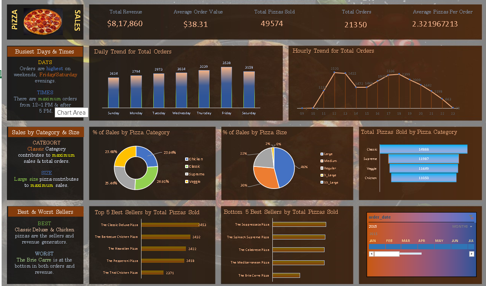

# 🍕 Pizza Sales Analysis

## 📌 Project Overview

This project analyzes pizza sales data to identify sales trends,
revenue performance, customer ordering patterns, and top-selling pizzas.

The project was created using **Excel and MySQL**.

## 🛠️ Tools & Technologies

- Microsoft Excel
- MySQL
- SQL
- Pivot Tables
- Data Cleaning
- Data Analysis
- Data Visualization

## 📊 Key KPIs

- Total Revenue
- Total Orders
- Total Pizzas Sold
- Average Order Value
- Average Pizzas Per Order

## 📈 Analysis Performed

- Daily sales trend
- Hourly sales trend
- Sales by pizza category
- Sales by pizza size
- Top-selling pizzas
- Bottom-selling pizzas
- Revenue analysis
- Order analysis

## 📊 Excel Dashboard

## 🔍 SQL Analysis

SQL was used to calculate KPIs and analyze sales performance using:

- SUM()
- COUNT()
- DISTINCTCOUNT
- GROUP BY
- ORDER BY
- ROUND()
- Subqueries
- Percentage calculations

## 🔄 Project Workflow

Raw Data  
↓  
Data Cleaning  
↓  
Excel Analysis  
↓  
Pivot Tables & KPIs  
↓  
Excel Dashboard  
↓  
SQL Analysis  
↓  
Business Insights

## 📁 Project Files

| File | Description |
|---|---|
| `Pizza_Sales_Dashboard.xlsx` | Excel analysis and dashboard |
| `pizza_sales_queries.sql` | SQL analysis queries |
| `pizza_sales_dashboard.png` | Dashboard screenshot |

## 🎯 Project Objective

The objective of this project is to demonstrate practical skills in:

**Excel → SQL → Data Analysis → Dashboard → Business Insights**

## 👨‍💻 Author

**Piyush Gour**

Aspiring Data Analyst

**Skills:** Excel | SQL | MySQL | Power BI | Python | Data Analysis
